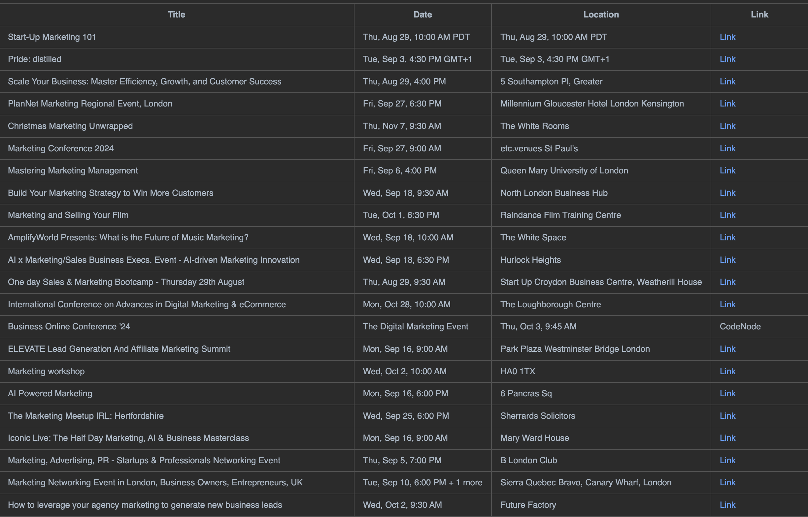

# Event Scraper

### Overview

This project is a Python-based web scraper designed to collect event details from LinkedIn, ConferenceIndex and Eventbrite. It extracts information such as the event title, date, location and a link to the eventand filters the event based on user's needs. The scraped data is saved in a CSV file and can be used for further analysis or integration into other tools.

### Features

- Web Scraping: Automatically scrape event information from LinkedIn and Eventbrite.
- Data Storage: Save the scraped data into a markdown file for easy access and analysis.
- Python-Based: Built with Python, using libraries like requests, BeautifulSoup, csv, and Selenium.

### Usage

Run following command:
```python 
python scraper.py 
```

## Output
**_Marketing Events in London:_** 



